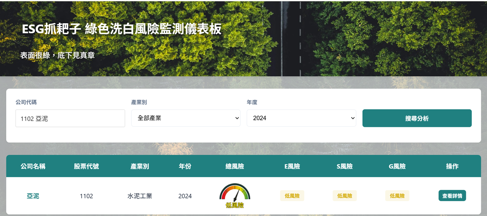
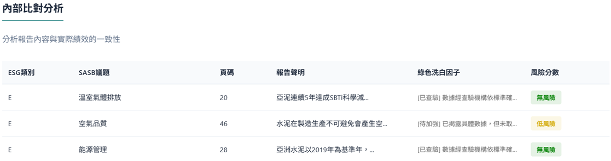
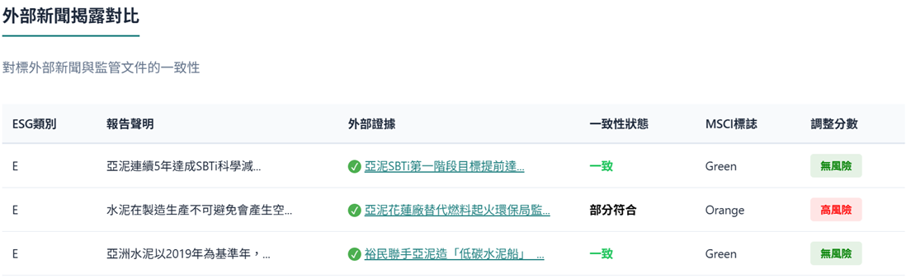
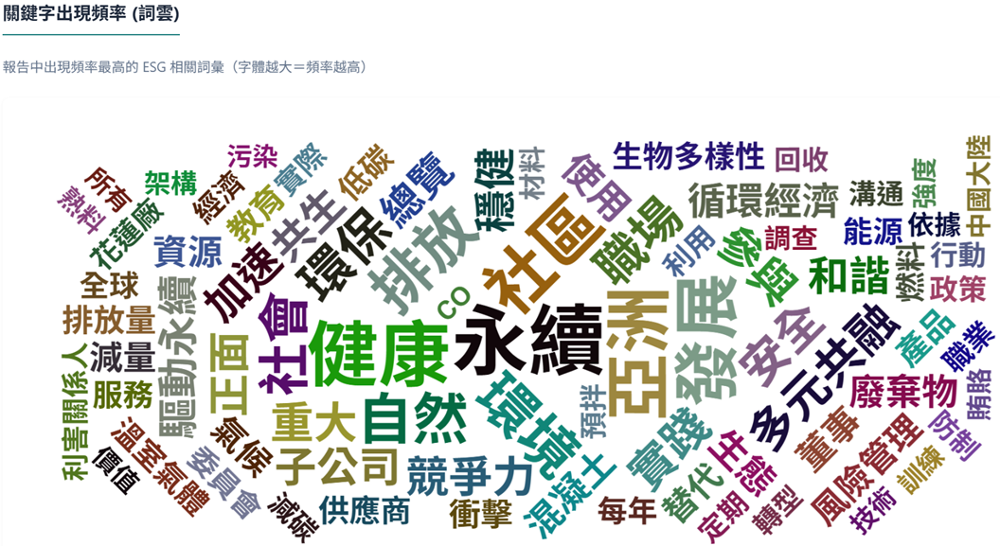
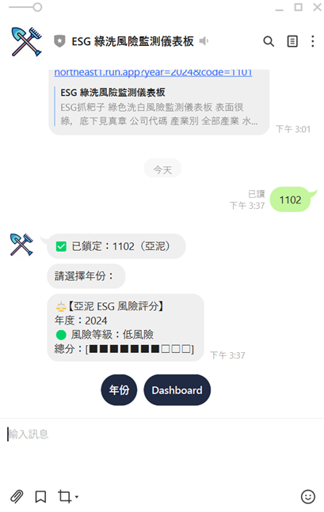
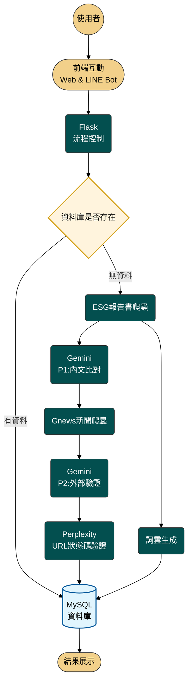

# ESG 抓耙子 (Greenwashing Detective)
### 深度挖掘，讓 ESG 不只是口號

「ESG 抓耙子」是一款利用生成式 AI 技術，針對企業永續報告書進行深度解析，並進行綠色洗白風險監測的工具。我們結合企業內部聲稱與外部新聞驗證，揭開永續報告書背後的真實面貌。

---

## 1. 背景與目的

* **因應法規及國際趨勢**：國際企業(Apple、Google、Microsoft等)皆積極推行 ESG 永續發展，並嚴格限制供應鏈碳排放；台灣金管會規定 2025 年起，全體上市櫃公司均應申報永續報告書；2026 年起正式開徵碳費。企業永續發展不再是選擇題，而是必答題。
* **解決痛點**：
    * **審查耗時**：一份報告書動輒200多頁，人工審閱效率極低。
    * **資訊不對稱**：目前的 ESG 評選機制缺乏針對「漂綠」內容的有效審查，導致永續獎項可能淪為漂綠工具。
* **專案目標**：
    1.  **協助監管機構**：自動化比對報告真實性，提升審查效率。
    2.  **協助投資人/大眾**：透過視覺化儀表板快速掌握企業 ESG 風險等級。
    3.  **協助企業內部自檢**：在發布前先行檢視是否存在模糊不清或具風險之聲明。

---

## 2. 成果展示

* **專案網頁**：[ESG抓耙子 綠色洗白風險監測儀表板](https://esg-app-546777032880.asia-northeast1.run.app/)
* **關鍵成果**：
    * **風險儀表板**：直觀呈現 E、S、G 三大面向的風險評分，並分為「無、低、中、高」四種風險等級。
    
    * **內文比對**：依據SASB 26項議題找出企業聲稱，並針對報告書前後文作比對，做出初步風險評分
    
    * **外部新聞驗證**：針對企業聲稱，比對新聞內容，是否存在不一致，並使用MSCI風險旗號，調整風險評分
    
    * **互動式文字雲**：透過 NLP 技術提取 ESG 關鍵字與模糊字詞（Fuzzy Dictionary），一眼看穿報告書重點。
    
    * **自適應網頁**：實作自適應網頁，提供多平台使用體驗。
    
    * **LINE Bot 即時查詢**：提供便利的入口，使用者輸入公司名稱年份即可快速獲取分析摘要。
    

---

## 3. 核心功能

* **自動化資料獲取**：
    * **報告書爬蟲**：自動從 ESG 平台抓取指定年度與公司的 PDF 報告。
    * **外部新聞蒐集**：整合 GNews 等工具，並行爬取相關企業之 ESG 負面或爭議新聞。
* **AI 深度解析 (LLM 串接)**：
    * **內文比對 (Prompt 1)**：提取 SASB 相關議題、具體聲稱及其對應頁碼，並針對前後文做比對，識別是否存在不一致。
    * **外部查證 (Prompt 2)**：將公司聲稱與外部證據比對，識別是否存在不一致。
    * **可靠性驗證 (Prompt 3)**：利用 **Perplexity API** 進行實時聯網，若原始連結失效，自動搜尋第三方可靠來源（排除官網），確保證據力。
* **風險修正系統**：結合內文聲稱、外部證據與 **MSCI 風險旗號**，動態計算最終風險分數。
* **斷點續傳機制**：後端實作 Checkpoint 功能，若 API 調用失敗或中斷，可從上次進度繼續，節省運算成本與時間。

---

## 4. 背景技術概述

* **前端開發**：HTML5, CSS3 (RWD 響應式設計), JavaScript (控制頁面互動與圖表呈現)。
* **後端框架**：**Python Flask** 負責處理 API 請求、任務調度與流程控制。
* **AI 與自然語言處理**：
    * **LLM**：Google **Gemini API** (主文本分析) / **Perplexity API** (外部搜尋驗證)。
    * **NLP 工具**：**Jieba** 斷詞處理、自定義 **ESG/Fuzzy 字典**、**PDFPlumber** 文本提取。
* **雲端與資料庫 (GCP)**：
    * **Cloud Run**：容器化部署 Web 服務與 LINE Bot。
    * **Cloud SQL (MySQL)**：結構化儲存企業資料、SASB 權重地圖及分析結果。
    * **Artifact Registry**：管理 Docker image。

---

## 5. 系統架構圖

